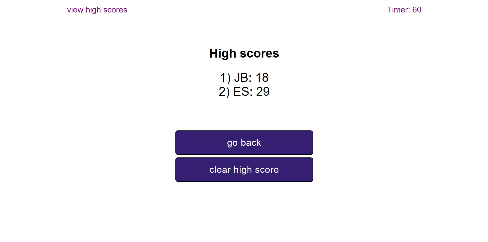

# c-w4-code-quiz
## Challenge Week 4 Code Quiz

## User Story

AS A coding boot camp student  
I WANT to take a timed quiz on JavaScript fundamentals that stores high scores  
SO THAT I can gauge my progress compared to my peers  

## Acceptance Criteria

GIVEN I am taking a code quiz  
WHEN I click the start button  
THEN a timer starts and I am presented with a question  
WHEN I answer a question  
THEN I am presented with another question  
WHEN I answer a question incorrectly  
THEN time is subtracted from the clock  
WHEN all questions are answered or the timer reaches 0  
THEN the game is over  
WHEN the game is over  
THEN I can save my initials and score  

## Screenshots - Desktop

Desktop main code quiz

Desktop during code quiz

Desktop end quiz, not high score

Desktop end quiz, with high score

Desktop quiz high score

## Screenshots - Mobile

Mobile main code quiz  
  

Desktop during code quiz  
  

Desktop end quiz, not high score  
  

Desktop end quiz, with high score  
  

Desktop quiz high score  
  

## Live Site

